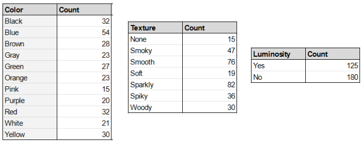
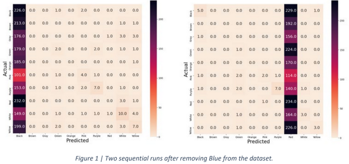
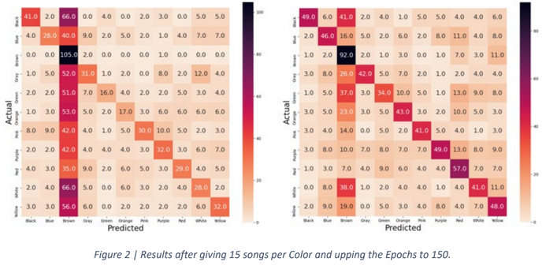
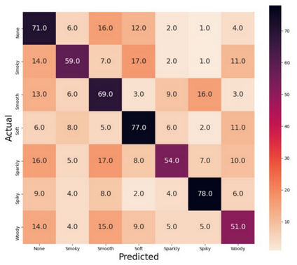
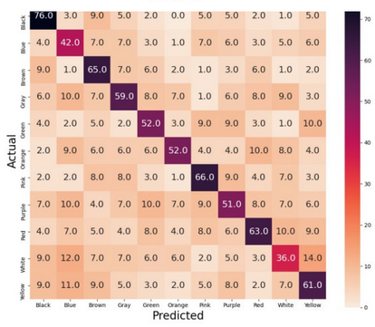
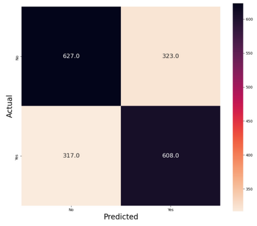

# Accuracy Reflection
When gathering data for this project, I wanted to make sure I had a range of music. To do this, I gathered an average of 15 songs for 20 different genres: Blues, Classical, Country, EDM, Hip hop, Jazz, K-pop, Lofi, Metal, New Age, Pop (... - 1999), Pop (2000 – 2010), Pop (2011- 2021), Rap, Reggae, Rock (Alternative), Rock (Modern), Rock (Classic), Rock (Punk), and Classical. 

I also wanted to make sure that each category had sufficient representation in my small dataset, so any category that did not have at least 15 songs, I asked my subject to search for songs of that type. For example, after the initial 300 songs were analyzed, there were only 12 Pink songs. My subject had to search out songs that were Pink to meet the minimum requirement. 

The resulting category distributions can be seen below:

  

After running my Color model for the 305 total songs, I was ending up with about 18% accuracy consistently—even after solving for overfitting. I played with the parameters for the neural network for hours without any good results. It was only after creating a confusion matrix that I was able to see what was happening. 

A confusion matrix allows us to visualize what was being guessed compared to the actual answer. Ideally, you will see the matrix diagonal stand out, indicating that it usually guesses correctly. However, in my first confusion matrix, we can see that the model was guessing Blue almost every time. 

 

I realized that taking the number of Blue samples divided by the number of total samples (54 / 305) is almost exactly 18% (0.177), which explained my poor accuracy. 
Most importantly, it indicated that my model was not actually ‘guessing’. It was simply choosing Blue every time. Because my number of Blue samples was so much higher, I ran the model again without any Blue samples at all. Again, I found that the next highest categories, Black and Red (both with 32 samples) was being chosen to guess every time.

  

Frustrated, I had concluded that synesthetic responses simply could not be replicated using AI. As a last-stitch effort, I decided that if all samples were equally represented, there would not be an obvious category to choose every time. I asked my subject to select the 15 songs that were ‘most obvious’ for each color to get the best representation from my small dataset.

With 15 of each color, the model was finally starting to show some promise. Although it still chose one color (Brown) to guess most of the time, we were finally starting to see the matrix diagonal light up with correct answers. After a few attempts of playing with the training rate, dropout probability, and regularization, I finally found that upping the epochs was giving me better results.

  

---

## Color
### 300 epochs | 50.3% accuracy

The Color model successfully reached the primary goal of 50%.

  

## Color
### 300 epochs | 50.3% accuracy

The Color model successfully reached the primary goal of 50%.

  

## Color
### 300 epochs | 50.3% accuracy

The Color model successfully reached the primary goal of 50%.

  

Accuracy report for all three categories can be found [here](https://drive.google.com/file/d/1zSFwNzc7aQ2I8wNxLzGFGn--V7_go92y/view?usp=sharing).

---
